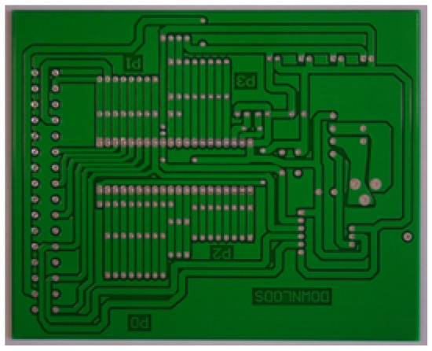
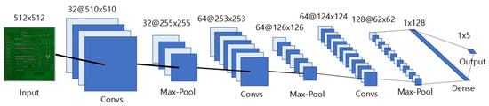
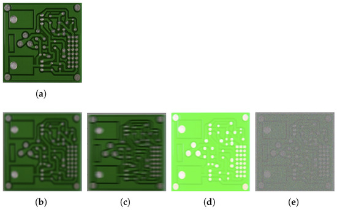

# 📦 Enhancement of Product-Inspection Accuracy Using CNN and Laplacian Filter

Official implementation of the Electronics 2023,12 paper:

📄 *Enhancement of Product-Inspection Accuracy Using Convolutional Neural Network and Laplacian Filter to Automate Industrial Manufacturing Processes*

[📖 Paper: Enhancement of Product-Inspection Accuracy](https://www.mdpi.com/2079-9292/12/18/3795) (https://www.mdpi.com/2079-9292/12/18/3795)

**Hyojae Jun**1 and **Im Y. Jung**2. *Electronics*, **2023**, *12*(18), 3795.

---

## 📝 Abstract

The automation of the manufacturing process for printed circuit boards (PCBs) requires **high-accuracy PCB inspections**, which depend on the **quality of captured images**.  
Low-quality images can significantly reduce inspection accuracy.

This study proposes a method that combines a **Convolutional Neural Network (CNN)** and a **Laplacian Filter** to enhance defect detection in PCB images.  
Our approach achieves:
- **+11.87% improvement** in classification accuracy of PCB images compared to existing methods.
- **+5.2% improvement** on images of other computer components when compared to CNN-only methods.

---

## 🚀 Highlights

✅ Combination of **CNN and Laplacian Filter** for defect detection  
✅ **11.87% improvement** in PCB classification accuracy  
✅ **5.2% improvement** on non-PCB computer component images  
✅ Suitable for **industrial manufacturing automation** processes  

---

## 📂 Dataset

You can download the PCB image datasets from the following links:

- [PKU Robotics Lab Dataset](http://robotics.pkusz.edu.cn/resources/dataset) (http://robotics.pkusz.edu.cn/resources/dataset)
- [Kaggle PCB Defects Dataset](https://www.kaggle.com/datasets/akhatova/pcb-defects) (http://robotics.pkusz.edu.cn/resources/dataset）

---

## 🖼️ Example Data & Model Architecture

### 1️⃣ Example of Initial Dataset (PCB Sample)

This is an example of a **normal PCB image** from the dataset used in this research.

---

### 2️⃣ CNN Model Architecture

The CNN structure used in this study is shown below.  
The input size is **512x512**, and the architecture consists of multiple convolution layers, max-pooling, and fully connected layers to perform **defect classification**.

---

### 3️⃣ Experiment 1 - Normal and Defective PCB Images

The following image shows examples of **normal and defective images** used in **Experiment 1**.  
Each defect type simulates a different common problem during PCB manufacturing and imaging.

| Label | Description          |
|-------|----------------------|
| (a)   | Normal Image         |          
| (b)   | Focus Defect         |
| (c)   | Motion Blur Defect   |
| (d)   | Light Overexposure   |
| (e)   | Noise Contamination  |

---

## 🔧 How to Use (Coming Soon)

> 📌 We will provide instructions on setting up the environment, training the model, and running inference in the next update.

---

## 📬 Contact  
If you have any questions, please reach out to me via the email below.

📧 **Email:** j4512j@naver.com
